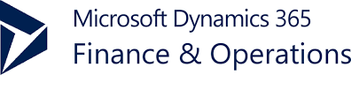

# Abhijeet Kumar
**DYNAMICS 365 FOR FINANCE AND OPERATIONS TECHNICAL CONSULTANT.** 

**Technical Consultant at Sonata Software Ltd.** 
**Previous Technical Analyst with Infosys Ltd.** 

**LinkedIn URL** : [Abhijeet](https://www.linkedin.com/in/abhijeet-kumar-091b0697)

##  OBJECTIVE
Seeking for a challenging career to implement the skills being acquired, I would like to utilize knowledge
and skills to the work assigned and add value to the organization with the help of fast learning ability
and sincerity.

##  TOTAL EXPERIENCE
**7.3 years**

##  PROFESSIONAL STRENGTH & CAREER SUMMARY:

1.  A Microsoft Dynamics AX **Technical Consultant** with **7+** years of experience.
2.  **4+** years of experience in working with latest version of AX i.e. **Dynamics 365 for Operations and
    AX7**.
3.  Worked on Integrating **Dynamics 365 FO** with external system such as **Hybris, LogicApp, SoosDB**
    using **OData, OData Action, Batch OData, Custom service**.
4.  Worked on **outbound framework** within D365 to connect **Dynamics 365 for operations with
    Azure service Bus using topics** for real time integration.
5.  Worked on outbound using **Business events and Data entities**.
6.  Experience with configuring **Postman** for integration testing.
7.  Worked on **D365 Upgrade from application version 1611 to application 7.3 PU 15**.
8.  Worked on several D365 FO implementation projects.
9.  Worked on Integration between **Dynamics 365 for Operation and D365 for Field, Sales and
    Service (CRM)**.
10. Extensive experience in customizing Microsoft Dynamics AX Tables, Extended Data Types, Views,
    Forms, Classes, Queries and Reports both in D365FO and Dynamics 2012.
11. Good Experience in D365 for Finance and Operation with development across various aspects
    of AX including the MorphX environment, Visual Studio, trace parser.
    
## WORK EXPERIENCE AND PROJECT EXPERIENCE:

**Project: Implementation of Dynamics 365 for Operations. 
Client – Brunswick Corporation, Australia,Singapore and Belgium.**

**Client Description:** Brunswick Corporation is a publicly held company listed on the New
York and Chicago stock exchanges, with sales over $5.2 billion in 2018. Brunswick is
having 16,000 employees around the world, three divisions in more than 30 countries
create a local environment. Their global headquarters is located in the Chicago suburb of
Mettawa, IL. Since Brunswick was founded in 1845, the Company has grown to become
a world leader in the marine industry. They have 175-year legacy of experience.

**Role**: Developer 
**Environment:** Dynamics 365 for Finance and Operation. 

Responsibilities: 

In a team of 7, as a Developer, Abhijeet is responsible for: 
- Working on User stories development as per the planned deliverables for the running
  sprint.
- Working on the CR development.
- As per the client requirement, working on customizing the existing and new process
  within D365FO for several legal entities.
- Customization involves tables, form, classes, report etc.
- Prepare Technical Design Documents, Unit test document.
- Preview the developed functionality to the stakeholders.
- Attended daily status call meetings.

**Project: Implementation of Dynamics 365 for Operations. 
Client – SANMAR Corporation, United States.**

**Client Description:** SanMar is an award-winning supplier of 16 retail and private brands of
imprintable apparel and accessories, including Port Authority, America’s No. 1 preferred private
label. SanMar is the exclusive distributor of Nike Golf, Eddie Bauer®, OGIO® and New Era®.
SanMar is based outside Seattle, WA, with eight national distribution centers

**Role**: Developer 
**Environment:** Dynamics 365 for Finance and Operation. 

Responsibilities: 

In a team of 6, as a Developer, Abhijeet was responsible for working with Microsoft for: 

- End to end in development and Go-Live support.
- Worked on bug fixing, support, CR development and new customizations during
  Support-Development phase.
- Numerous integration interface development and customizations in D365 for operations
  as per the client requirement and approved Microsoft document.
- Integrating D365FO with Hybris, LogicApps and SoosDB &amp; other external system using
  synchronous/real time integration pattern for inbound trigger from external system by
  exposing data entities.
- Development of D365 Inbound process using data entities to automate various
  processes in D365 using the ODATA, ODATA action, BATCH and JSON based integration.
- Designing the Outbound framework in D365 using Azure Service Bus and ASB Topics for
  message sending out of D365 to other system.
- Creation of Events, Event handlers &amp; sending outbound messages using data entities to
  other external systems for numerous scenarios in D365 for operation through service
  bus topics.
- Creation of Entities for BYOD process.
- Configuration and scenario testing using postman tool.
- Preparing the Technical design document and unit test case document preparation for
  each IDD and FDD.
- Demo and functionality walkthrough to functional consultants at client side post.
- Ensuing the highest level of code quality along with no best practice’s warnings as per
  Microsoft standards.
- Responsible for unit testing, bug fixing and support.

**Project: Implementation of Dynamics 365 for Operations. 
Client – BJ Services (Byron Jackson Company), United States &amp; Canada.**

**Client Description:** BJ Services is the largest North American-focused, pure-play pressure
pumping services provider. BJ Services provides hydraulic fracturing and cementing services to
leading upstream oil and gas companies engaged in the exploration and production of North
American oil and natural gas resources. BJ Services Company is also a leading worldwide
provider of oilfield services  for the  petroleum industry

**Role**: Developer 
**Environment:** Dynamics 365 for Finance and Operation. 

Responsibilities: 

- Worked on Dynamics 365 Upgrade from Application version 1611 to Application version
  7.3 PU15
- Entire code refactoring from Over-layering model to Extensions model
- Worked on Microsoft Dynamics 365 for Finance and Operation implementation.
- Worked on Integration between Dynamics 365 for Operation and Dynamics 365 CRM
  using SOAP and Batch DLL process.
- Involved in various customizations on forms, tables, classes along with integration
  development.
- Worked on Security Configuration in the project.
- Worked on Report development, and Code migration/ deployment activity.
- Involved in migration of D365 Finance and Operations production database from Azure
  SQL Database to a SQL Server environment in 1611 application version to SQL Server
  environment 7.3 application version
- Post Go-Live worked on Hyper-care support where along with bug resolutions in time
  bound manner, looked after incident monitoring from offshore.
- Worked on Technical Design Document/ Integration Design Document.
- Creating KB articles and sharing it across team, so that resources joining the team can
  quickly cope up with the basic functionality.
  
**Project: Solution Development of Microsoft Dynamics AX 2012 R3 and AX 7. 
Client: Infosys vertical named Clinical Trial Supply Management solutions on AX 7 and AX
2012 R3.**

**Role**: Developer 
**Environment:** AX7 and AX 2012 R3 

Responsibilities: 

- Involved in development of a vertical Clinical Trial Supply management solution in AX 7
  and AX 2012 versions.
- Understanding the requirements and develop the application.
- Involved in App Source Listing Activities for CTSM.
- APP Reference in Dynamics Market: 
  [Clinical Trial Supply Chani Management Appsource](https://appsource.microsoft.com/en-za/product/dynamics-365-for-operations/infosys.19642870-63d2-4388-a7cc-9a47315e8576?tab=Overview)
- Prepared technical design documents.

**Project: Solution Development of Microsoft Dynamics AX 2012 R3. 
Client: Infosys vertical named Infosys Dynamics Oil Field Solution (OFS).**

**Role**: Developer 
**Environment:** AX 2012 R3 

Responsibilities: 

- Integrated Dynamics AX 2012 with Dynamics CRM 2015 using AIF.
- Customization of forms, tables, classes etc. for various integration process.
- Prepared technical design documents.

**Project: Upgradation from AX 2012 R2 to AX 2012 R3 
Client: Superior Energy Services.**

**Client Description:** Superior Energy Services, Inc. provides oilfield services and equipment to oil
and natural gas exploration and production companies in the United States, the Gulf of Mexico,
and internationally. The company operates in four segments: Drilling Products and Services,
Onshore Completion and Workover Services, Production Services, and Technical Solutions.

**Role**: Developer 
**Environment:** AX 2012 R3 

Responsibilities: 

- Basic training in Microsoft Dynamics AX 2012 R3 version.
- Post training worked on customizations of forms tables, classes etc. as per client
  requirements.
- Various new reports development and modifications in existing reports.
- Extensively worked on Bug Fixes along with root cause analysis to make the system
  bug/error free for go-live without any show stopper.
- Post Go-Live provided the support to the production system.
- Technical Design Documents (TDDs) prepared as per client requirements.
- Installation and Setup of AX server is done for AX 2012 R3 along with reports
  deployment activity.
  
##  AWARDS AND ACHIEVEMENTS:

- Received DNA award in year 2021 as an appreciation 
  for my technical contribution for projectBrunswick.
- Receive DNA award in year 2020 as an appreciation
  for my technical contribution for project SanMar.
- Received "Titans Award" as an appreciation for my
  technical contribution for project "BJ Services" in year 2018
- Received an "Insta Award" as an appreciation for
  technical contribution in "Oil Field Service" Solution
  and Project Development in year 2017.
- Received an "Insta Award" as an appreciation for showcasing
  good skills Support monitoring for client and making BJ support
  mode achieve defined SLA.
- Received Client appreciation for the dedicated work done in project.

##  CERTIFICATION: 

- MB6-894- Development, Extensions and Deployment for Microsoft Dynamics 365 for Finance
  and Operations.
- MB6-890 - Microsoft Dynamics AX 7 Development Introduction.
- MB6-704 - Microsoft Dynamics AX 2012 R3 CU8 Development Introduction.
- MB6-869 – Microsoft Dynamics AX 2012 Development introductions.

## EXTRA CURRICULAR ACTIVITIES:

- Secured 1 st place in Basketball in SPIRIT 2016- Annual Intra DC Sport Meet held at Infosys Pune.
- Runner up in Basketball in SPIRIT 2017- Annual Intra DC Sport Meet held at Infosys Pune.
- Appreciated with certificate for my contribution in organizing the basketball tournament for
  SPIRIT 2017.
- Won Olympiad Inter Corporate Basketball organized by Deccan Gymkhana, Pune.
- Runner up in Inter Corporate Basketball organized by Deccan Gymkhana, Pune.
- Represented Infosys in Hyderabad &amp; Pune Basketball Inter corporate tournament.
- Won Tyro Kick football tournament and secured Runner Up position in T-Tycoon in Yash 12.0.
- Awarded with certificates for wining in few events and participation in some events at school.

## EDUCATIONAL QUALIFICATION: 

###### Graduation:

University      : RTM Nagpur University(Autonomous)
College         : Yeshwantrao Chavan college of Engineering,
                  Nagpur, Maharashtra.
Graduation Year : 2014
CGPA            : 6.96

###### Higher Secondary Certificate(HSC):

School     : The Air Force School, Subroto Park, New Delhi
Year       : 2010
Percentage : 78.40%

###### Secondary School Certificate(SSC):

School     : The Air Force School, Subroto Park, New Delhi
Year       : 2008
Percentage : 81.20%

## PERSONAL DETAILS:

Date of Birth  : 11th October-1992  
Marital Status : Married 
Nationality    : Indian 
Languages      : English, Hindi 
Hobbies        : Playing and watching basketball and football. 

##  💬 Connect me at:
📫 Mail: [iabhijeetkr92@gmail.com]  

**LinkedIn QR** 

